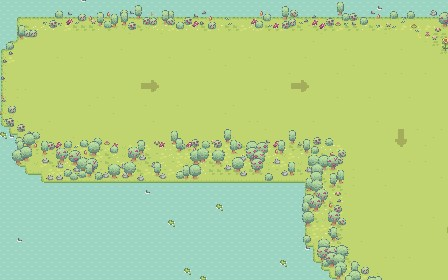
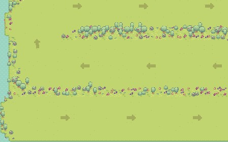

# Dyadic Force

  

两只猴子锁在大球直径两端。同向推，球往前滚；反向推，球原地转。撞到障碍会掉血，正式关还要在倒计时内停到传送门上。

标题页打开 **实验模式** 后，同一套玩法会按预实验协议记日志。

## 玩法

| | 键盘 | 手柄 |
| --- | --- | --- |
| **P1** | `W A S D` | 左摇杆 / 十字键 |
| **P2** | `↑ ← ↓ →` | 左摇杆 / 十字键 |
| 菜单 | Enter / Space | A |

配对必须双方主动加入，没有默认绑定。

- 加入：P1 按 `WASD`，P2 按方向键，或手柄按 **A**
- 退出：P1 按 `X`，P2 按 `Delete`，手柄按 **B**
- 双方都在之后才能 START；手柄拔出后对应槽位腾空

`标题` → `实验信息录入（实验模式）` → `配对` → `选关` → `关卡` → `结算`

## 五关

每关只练一件事。练习关无计时；正式关有倒计时、生命值和星级结算。

| 第 1 关 · 共同起步 | 第 2 关 · 共同减速 | 第 3 关 · 弯道协调 |
| :---: | :---: | :---: |
|  |  |  |
| 三扇可撞门，门间缓弯后重新加速 | 长直道接两次回转 | 左右弯配对，复用第 1 关的门 |

| 第 4 关 · 失衡补偿 | 第 5 关 · 路线选择 |
| :---: | :---: |
|  |  |
| 隐藏路段真实干扰，用干扰前 200 ms 做局部基线 | 短窄与长宽两条岔路，汇合后再过一扇门 |

第 3 / 4 / 5 关由样条生成，没有直角拐。改完布局后跑 `tools/layout_audit.gd`，它会把美术图和调试图写到 `docs/layout_previews/`。README 用图可用 `tools/compose_readme_images.gd` 重出。

## 预实验

每台电脑在设置里保存一次 **本站编号**。录入页只填组内数字，系统生成：

`S1-D001` / `S1-D001-A` / `S1-D001-B`

左右屏按组号奇偶分配。没有全局 Baseline / Perturbation 分组：第 3 关记正常协调，第 4 关固定真实干扰。两关不能包装成严格对照。

数据写在游戏可写目录：

`user://experiments/dyad-S1-D001/<UTC时间>/raw|results/`

- `raw/`：`session.csv` / `frames.csv` / `events.csv`，不可覆盖
- `results/`：有数据才写结果表
- 全部结束后用 `tools/aggregate_experiments.gd` 汇总到 `_aggregate/`

标题页的「打开数据文件夹」会进入该根目录。现场流程见 [预实验 SOP](docs/pilot_experiment_protocol.md)。

## 运行

- 引擎：**Godot 4.6**（Forward Plus）
- 主场景：`scenes/title_screen.tscn`

## 文档

- [五关扩展需求](docs/five_level_expansion_requirements.md)
- [预实验 SOP](docs/pilot_experiment_protocol.md)
- [现场记录表](docs/pilot_field_log.md)
- [实验数据字典](docs/experiment_data_dictionary.md)（schema `3.1.0`）

## 架构

- Autoload：`GameState` / `InputHub` / `SceneDirector`
- 关卡数据：`resources/level_def.gd` + `levels/*.tres`
- 通用关卡场景：`scenes/level.tscn`

界面用 Sprout Lands UI 与 Controllers & Keyboard 按键图；关卡角色来自 Jungle Monkey Platformer。第 1 关撞门尘土来自 Pixel Frog *Pixel Adventure 1*。详见 `assets/` 与 `assets/topdown/CREDITS.txt`。
