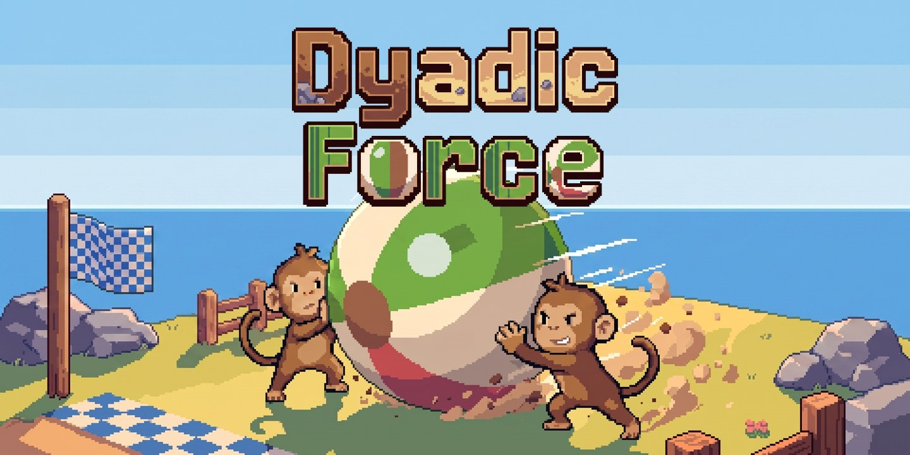
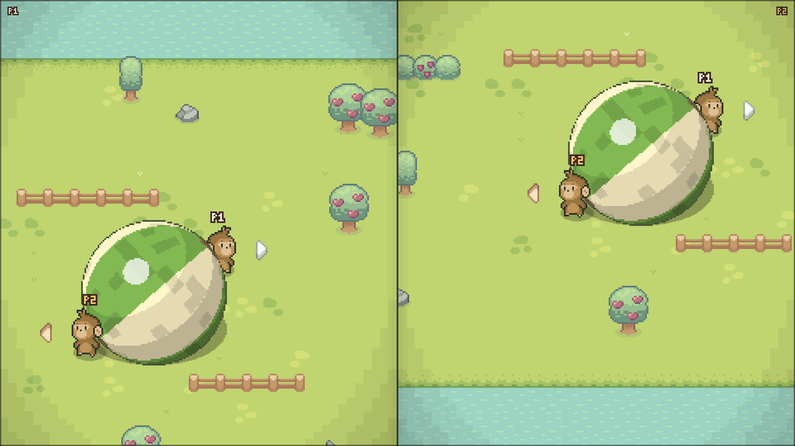
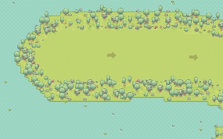
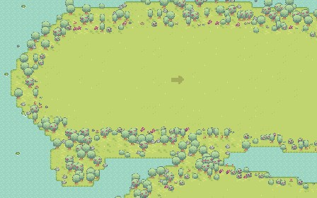
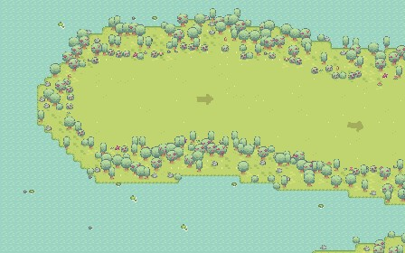
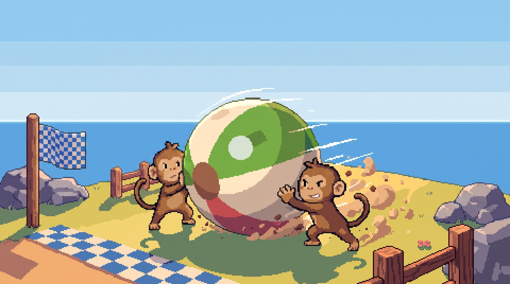
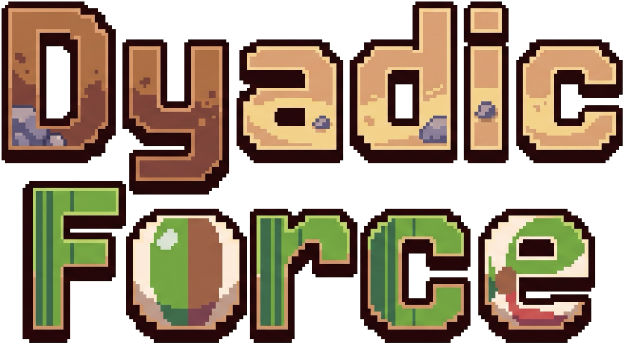

# Dyadic Force 论文游戏设计材料包

本目录把论文中“游戏与关卡设计”部分可能使用的文字材料和图片副本集中在一起，便于直接复制、打包或交给合作者。

## 目录内容

```text
paper_game_design/
├── README.md
├── game_design_section.md
├── figure_manifest.md
└── images/
    ├── fig01_game_concept_hero.jpg
    ├── fig02_split_screen_gameplay.png
    ├── fig03_level_1_joint_start.jpg
    ├── fig04_level_2_joint_braking.jpg
    ├── fig05_level_3_curve_coordination.jpg
    ├── fig06_level_4_imbalance_compensation.jpg
    ├── fig07_level_5_route_choice.jpg
    ├── fig08_title_art_without_logo.jpg
    ├── fig09_game_logo.png
    └── fig10_macos_app_icon.png
```

## 建议优先使用的论文图片

### 核心概念图



适合：

- 论文首页或系统概览；
- Introduction 结尾；
- 展示游戏主题。

不适合：

- 解释真实游戏界面；
- 作为实验装置截图。

### 实际双人分屏



适合：

- System / Apparatus；
- 解释 P1/P2 分屏；
- 展示猴子、球体、输入箭头与像素环境。

这是当前材料中最适合解释实际交互的一张图。

### 五关概览

| 第 1 关 | 第 2 关 | 第 3 关 |
|---|---|---|
|  |  |  |

| 第 4 关 | 第 5 关 |
|---|---|
|  |  |

适合：

- 组合为一个五子图；
- 解释五关分别诱发的合作行为；
- Design Rationale 或 Task Design。

限制：

- 单图只有 448×280；
- 当前更适合作为路线/环境示意，不适合整页大图；
- 图片早于最近的门阈值和时限调整；
- 正式投稿前建议按冻结版本重新高分辨率截取。

## 其他可用图片

### 无 Logo 标题插画



可用于作品集、系统概览或不需要游戏名称的背景。它不是实际游戏操作截图。

### 独立 Logo



透明背景 PNG，可用于图版排版。论文正文通常不需要单独放 Logo。

### macOS 应用图标


适合软件交付或作品集，不建议作为学术论文的主要系统图。

## 推荐论文图版结构

### 方案 A：一张系统概览图

- 左侧：`fig02_split_screen_gameplay.png`
- 右上：输入到球体施力的简图（尚需绘制）
- 右下：五关名称与行为目标

适用于页数有限的短论文。

### 方案 B：两张图

**Figure 1 — Game concept and interface**

- `fig01_game_concept_hero.jpg`
- `fig02_split_screen_gameplay.png`

**Figure 2 — Five level designs**

- `fig03` 至 `fig07` 组成五子图；
- 子图下只写行为目标，不堆叠参数。

### 方案 C：三张图

1. 核心交互与分屏；
2. 五关地图；
3. 数据管线或扰动设计图。

适用于完整论文或 thesis。

## 正式投稿前需要补拍的图片

当前材料尚缺以下高价值图片：

- 教学关中的低难度门；
- 第 1 关实际撞门瞬间；
- 第 2 关回转和共同减速；
- 第 3 关左右弯与森林分区；
- 第 4 关干扰 HUD；
- 第 5 关短窄/长宽岔路同屏画面；
- 传送门靠近、激活和完成的三阶段；
- 实验录入与配对流程；
- 结算页共同轨迹；
- 输入校准界面；
- 带门、路段、岔路后台标注的调试图。

这些图应在正式收数所用 commit 冻结后统一截取。

## 图片使用注意事项

1. 五关图片属于当前开发快照，不代表正式实验冻结版本。
2. 概念主视觉和标题插画不是实际游戏画面，图注中必须说明。
3. 第三方素材来源与授权见 `figure_manifest.md` 和上级目录的 `game_production_materials.md`。
4. Sprout Lands Basic 只明确允许非商业项目使用，商业发布需另行取得许可。
5. 投稿前确认期刊或会议对图片 DPI、色彩空间、字体大小和匿名化的要求。
6. 双盲投稿时，图中不得包含作者、机构、电脑用户名或本地路径。

## 相关材料

- [`game_design_section.md`](game_design_section.md)：论文游戏设计章节素材；
- [`figure_manifest.md`](figure_manifest.md)：图片尺寸、用途、图注和来源；
- [`../game_production_materials.md`](../game_production_materials.md)：完整游戏制作素材；
- [`../academic_paper_materials.md`](../academic_paper_materials.md)：完整论文素材库。

